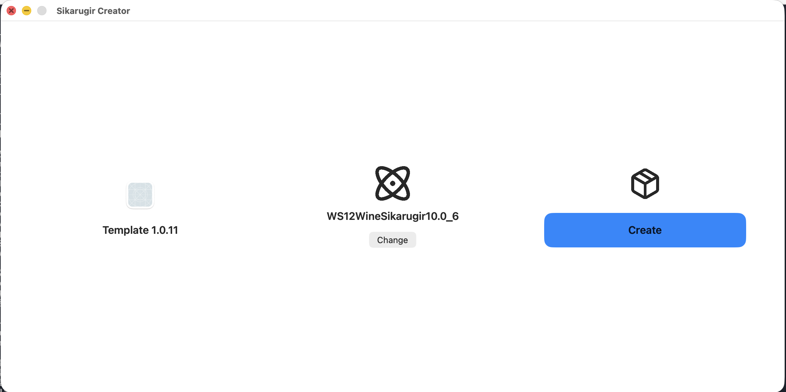
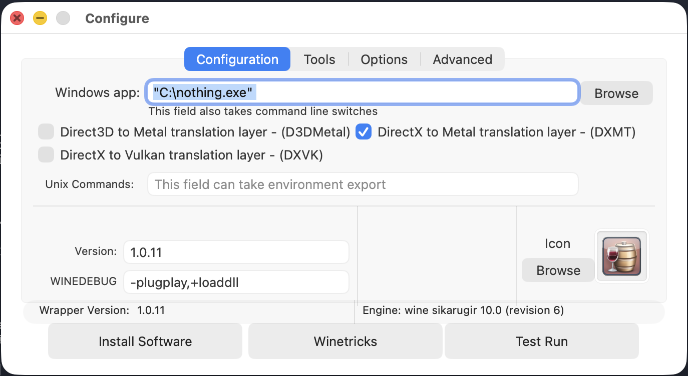
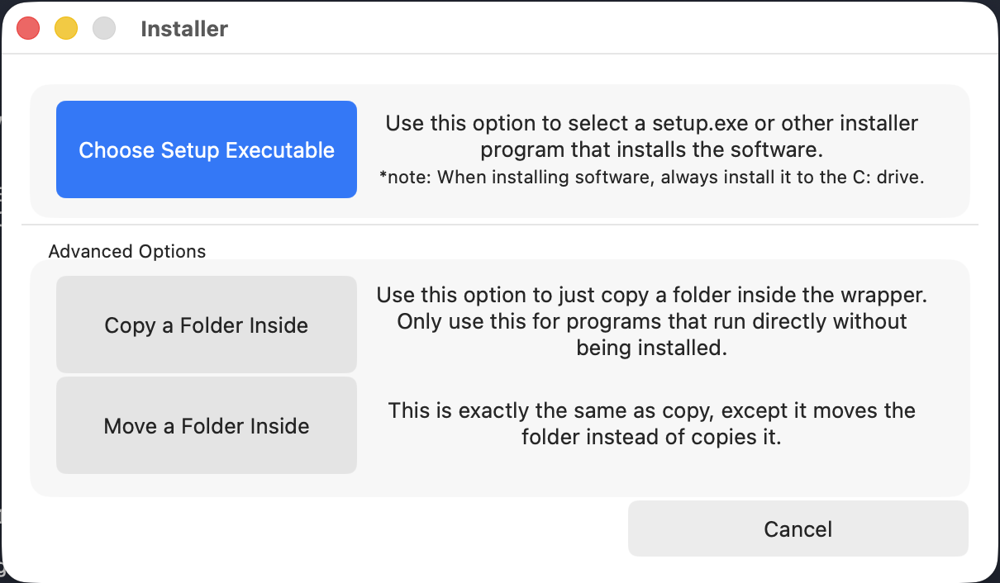
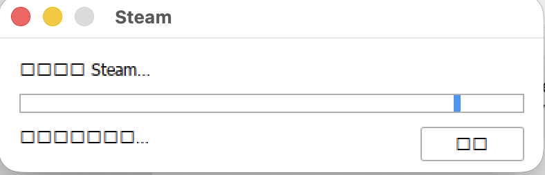
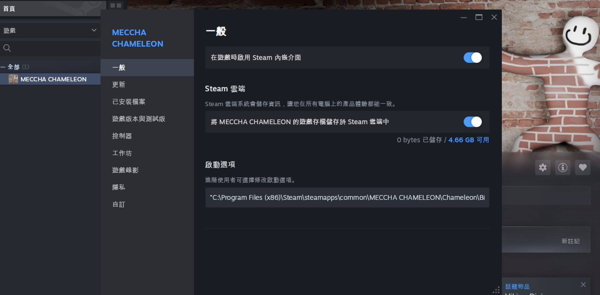

# 在 Mac 上免費玩 Windows 限定的 Steam 遊戲 🦎 / Play Windows-only Steam games on Mac for free

**🌏 語言 / Language：[繁體中文](#繁體中文) ・ [English](#english)**

以 **MECCHA CHAMELEON**（躲貓貓）為範例，但方法適用於大多數 Steam 上的 Windows 遊戲。
Uses **MECCHA CHAMELEON** as the worked example, but the method works for most Windows games on Steam.

---

<a name="繁體中文"></a>
# 繁體中文

在 **Apple Silicon Mac（M 系列）** 上，用**完全免費**的工具跑 Windows 限定的 Steam 遊戲——不用買 CrossOver、不用虛擬機，靠 [Sikarugir](https://github.com/Sikarugir-App)（Wine + 原生 Metal/DXMT）就能讓 **3D 完整渲染**。

## ⚠️ 先確認適用範圍（很重要）
| | 說明 |
|---|---|
| ✅ 適合 | 大多數單機 / 一般多人的 Windows Steam 遊戲（DirectX 11 / 12）|
| ❌ 不適合 | 有**反作弊**的遊戲（EAC、BattlEye 等基本上跑不了）|
| ⚠️ 注意 | 每款遊戲的相容性、效能、設定（尤其**啟動參數**）可能不同，需要個別微調 |

> 這不是保證每款都能跑的魔法，而是一套「值得一試」的通用方法。MECCHA CHAMELEON 是已驗證可行的範例。

## 環境需求
- Apple Silicon Mac（M1/M2/M3/M4/M5…）
- 較新的 macOS
- 數 GB 可用空間（每款遊戲另計）
- ⏱ 整個處理過程約 **20 分鐘**（環境安裝 + 建 wrapper + 裝 Steam）

## 步驟 1️⃣：一鍵安裝環境（Rosetta + Homebrew + Sikarugir）
打開「**終端機**（Terminal）」，貼上：
```bash
curl -fsSL https://raw.githubusercontent.com/nothinglo/meccha-chameleon-mac/main/setup.sh -o setup.sh && bash setup.sh
```
- 約需 **10–15 分鐘**，過程只會在一開始問你一次開機密碼。
- 腳本只安裝工具（Rosetta 2 / Homebrew / Sikarugir Creator）+ 順便下載 Steam 安裝檔，**不會碰你的個人檔案**，可重複執行。
- 裝完會自動開啟 **Sikarugir Creator** 與 Finder。

## 步驟 2️⃣：建立遊戲 wrapper
在 **Sikarugir Creator**：
1. 按 **Download Template**
2. 按 **Change** 選引擎 → **務必選 `WS12WineSikarugir10.0`**（Wine 10）
3. 按 **Create** → 命名（例如 `MeccaChameleon`）
4. 建立完成後會跳一個小視窗 → 按 **Launch it** 打開 Configure 設定視窗

> ⏱ 按 Create 後建立 wrapper **約需 5 分鐘**、畫面會轉圈圈，請耐心等。



## 步驟 3️⃣：啟用 DXMT（畫面關鍵！）
Configure 視窗 → 勾選 **「DirectX to Metal translation layer — (DXMT)」**

> ⚠️ **一定要用 DXMT，不要用 DXVK**。DXVK 走 MoltenVK，許多 UE 遊戲的 3D 主畫面會**全黑**（只剩選單）；DXMT 是原生 Metal，才能完整渲染。



## 步驟 4️⃣：安裝 Steam
步驟 1 的腳本已把 `SteamSetup.exe` 下載到 `~/Downloads`。
1. 在 Configure 視窗按 **Install Software** → 選 `~/Downloads/SteamSetup.exe`
2. 若跳**警告（warning）是正常的**，按掉繼續即可；**按完等幾秒鐘，Steam 安裝視窗就會跳出來**。
3. 安裝視窗出現後，**一路按「下一步 / 確定」用預設值即可**（不用改任何設定）。此時 Configure 視窗可能顯示 **busy**，正常。
4. 若等了還是沒跳出來，**點一下右下角 / Dock 的「藍底 wine 圖示」**把它叫出來。
5. 裝完後**過幾分鐘 Steam 會自動打開**。



> 💡 Steam 安裝/更新的**進度小視窗**可能有少數中文變 □□（像下圖）——那是 Steam 自己的暫時畫面、不影響安裝、裝完就消失，可忽略。
> 若 `~/Downloads` 沒有 SteamSetup.exe，可自行到 [store.steampowered.com](https://store.steampowered.com/about/) 下載。



## 步驟 5️⃣：登入 Steam、安裝遊戲
Steam 已在上一步自動打開（**不需要再做 Test Run**）：
1. **登入**你的 Steam 帳號
2. 在媒體庫**安裝你的遊戲**（例如 MECCHA CHAMELEON）
3. **（重要，設定日後啟動）** 回 **Configure 視窗** → 在 **Windows app（主程式）** 的下拉選單選 `steam.exe`。
   - 若 Configure 還停在安裝/選檔的畫面，**先按 `Cancel`** 才會回到有「Windows app」下拉選單的主畫面。
   - 下拉選單通常**已經有 `steam.exe`**；若沒看到，按 **Browse**（開的是 Mac 檔案視窗）→ 按 `Cmd + Shift + G` 貼上這串完整路徑前往：
     `~/Applications/Sikarugir/MeccaChameleon.app/Contents/SharedSupport/prefix/drive_c/Program Files (x86)/Steam/steam.exe`
     （把 `MeccaChameleon` 換成你步驟 2 命名的名字）
   - 選好就生效、**會自動儲存、不用按其他按鈕**，直接關閉視窗即可。之後點兩下 `~/Applications/Sikarugir/` 裡的 wrapper `.app` 就會自動開 Steam（**開啟後可能要等幾秒鐘 Steam 才會跳出來**，請稍等）。

> 沒設這個的話，點 wrapper 的 `.app` 不會開 Steam（會停在安裝程式或沒反應）。
> 若 Configure 視窗已關閉，可在 **Sikarugir Creator** 重新開啟該 wrapper 的 **Configuration** 再設。

## 步驟 6️⃣：設定啟動參數（視遊戲而定）
有些遊戲的啟動器會擋你（例如跳「需要 Visual C++」）。解法是讓 Steam **直接啟動遊戲本體**：
遊戲 **右鍵 → 內容 → 啟動選項**，貼上指向該遊戲 **Shipping/主執行檔** 的路徑（**含前後的雙引號 `"` 一起複製**），例如 MECCHA CHAMELEON：
```
"C:\Program Files (x86)\Steam\steamapps\common\MECCHA CHAMELEON\Chameleon\Binaries\Win64\PenguinHotel-Win64-Shipping.exe" %command%
```
> 路徑依遊戲不同，請到 `steamapps\common\<遊戲>\...\Binaries\Win64\` 找到真正的 `*-Shipping.exe`。不是每款都需要這步——先直接玩，遇到啟動器擋人再設。



## 步驟 7️⃣：開玩 🎉
從 **Steam 按 Play** 啟動遊戲。
> ⚠️ **務必從 Steam 啟動**。直接跑 exe 會出現 `invalid or missing authentication token`。

**以後要玩**：點兩下 wrapper 的 `.app`（在 `~/Applications/Sikarugir/`）→ 自動開 Steam（**等幾秒鐘才會跳出來**）→ 按 Play。（前提：步驟 5 已把 Windows app 設成 `Steam.exe`）

## 🛠 疑難排解 FAQ
| 問題 | 解法 |
|---|---|
| 點 wrapper 沒反應 | 先到「活動監視器」關掉殘留的 `steam` / `wine` 程序再開 |
| 3D 主畫面全黑、只剩選單/HUD | 你用到 DXVK 了 → 改用 **DXMT** |
| `invalid / missing authentication token` | 一定要**從 Steam 按 Play** 啟動，不能直接跑 exe |
| 跳「需要 Visual C++ / 找不到元件」 | 用步驟 6 的**啟動參數**直接指向 Shipping exe |
| 反作弊遊戲打不開 | 目前無解（EAC/BattlEye 跑不了）|

## 🧹 不想玩了？一鍵清除
移除本教學裝/載的東西（會**保留** Homebrew、Rosetta 等系統共用工具）：
```bash
curl -fsSL https://raw.githubusercontent.com/nothinglo/meccha-chameleon-mac/main/cleanup.sh -o cleanup.sh && bash cleanup.sh
```
會移除：遊戲 wrapper（含 Steam 登入與已下載遊戲）、Sikarugir Creator、下載的 SteamSetup.exe。執行時需輸入 `yes` 確認。

---

<a name="english"></a>
# English

Run Windows-only Steam games on an **Apple Silicon Mac (M-series)** with **100% free** tools — no CrossOver, no virtual machine. Using [Sikarugir](https://github.com/Sikarugir-App) (Wine + native Metal / DXMT), you get **full 3D rendering**.

## ⚠️ Scope first (important)
| | Notes |
|---|---|
| ✅ Works for | Most single-player / casual-multiplayer Windows Steam games (DirectX 11 / 12) |
| ❌ Won't work | Games with **anti-cheat** (EAC, BattlEye, etc. generally won't run) |
| ⚠️ Note | Each game's compatibility, performance, and settings (especially **launch options**) can differ |

> Not magic that runs every game — a solid "worth a try" method. MECCHA CHAMELEON is a verified working example.

## Requirements
- Apple Silicon Mac (M1/M2/M3/M4/M5…)
- A recent macOS
- A few GB free (plus space per game)
- ⏱ The whole process takes about **20 minutes** (setup + create wrapper + install Steam)

## Step 1️⃣: One-shot environment setup (Rosetta + Homebrew + Sikarugir)
Open **Terminal** and paste:
```bash
curl -fsSL https://raw.githubusercontent.com/nothinglo/meccha-chameleon-mac/main/setup.sh -o setup.sh && bash setup.sh
```
- Takes about **10–15 minutes**; it asks for your login password once at the start.
- Installs only tools (Rosetta 2 / Homebrew / Sikarugir Creator) and downloads the Steam installer; it **doesn't touch your personal files** and is safe to re-run.
- It auto-opens **Sikarugir Creator** and Finder when done.

## Step 2️⃣: Create the game wrapper
In **Sikarugir Creator**:
1. Click **Download Template**
2. Click **Change** → **choose `WS12WineSikarugir10.0`** (Wine 10)
3. Click **Create** → name it (e.g. `MeccaChameleon`)
4. When it finishes, a small dialog appears → click **Launch it** to open the Configure window

> ⏱ After Create, building the wrapper takes **~5 minutes** (the UI spins) — be patient.


## Step 3️⃣: Enable DXMT (the key to graphics!)
In the Configure window, tick **"DirectX to Metal translation layer — (DXMT)"**

> ⚠️ **Use DXMT, NOT DXVK.** DXVK (via MoltenVK) renders a **black** 3D scene for many Unreal games (only the menu shows). DXMT is native Metal and renders correctly.


## Step 4️⃣: Install Steam
The Step 1 script already downloaded `SteamSetup.exe` to `~/Downloads`.
1. In the Configure window click **Install Software** → pick `~/Downloads/SteamSetup.exe`
2. Any **warning is normal** — dismiss it; **then wait a few seconds and the Steam installer window pops up**.
3. When the installer appears, **click Next / OK through the defaults** (nothing to change). The Configure window may show **busy** — that's normal.
4. If after waiting it still doesn't appear, **click the blue wine icon in the Dock / menu bar** to bring it up.
5. After it finishes, **Steam opens by itself in a few minutes**.


> 💡 Steam's **install/update progress window** may show some □□ (like below) — that's Steam's own transient screen; it doesn't affect installation and disappears when done.
> If `~/Downloads` has no SteamSetup.exe, grab it from [store.steampowered.com](https://store.steampowered.com/about/).


## Step 5️⃣: Log in, install the game
Steam already opened in the previous step (**no Test Run needed**):
1. **Log in** to your Steam account
2. **Install your game** from the library (e.g. MECCHA CHAMELEON)
3. **(Important — sets up future launching)** Back in the **Configure window**, pick `steam.exe` from the **Windows app** dropdown.
   - If Configure is still on the install / file-picker screen, **click `Cancel` first** to get back to the main screen that has the "Windows app" dropdown.
   - The dropdown usually **already lists `steam.exe`**; if not, click **Browse** (a Mac file dialog) → press `Cmd + Shift + G` and paste this full path:
     `~/Applications/Sikarugir/MeccaChameleon.app/Contents/SharedSupport/prefix/drive_c/Program Files (x86)/Steam/steam.exe`
     (replace `MeccaChameleon` with the name you chose in Step 2)
   - It **saves automatically — no extra button to press**, just close the window. After this, double-clicking the wrapper `.app` in `~/Applications/Sikarugir/` opens Steam directly (**it may take a few seconds to appear** — be patient).

> Without this, double-clicking the wrapper `.app` won't open Steam (it stalls on the installer or does nothing).
> If the Configure window is already closed, reopen the wrapper's **Configuration** from **Sikarugir Creator**.

## Step 6️⃣: Set launch options (game-dependent)
Some games' launchers block you (e.g. "Visual C++ required"). Fix: make Steam **launch the game's main exe directly**.
Right-click the game → **Properties → Launch Options**, paste the path to the game's **Shipping/main exe** (**copy the surrounding double-quotes `"` too**), e.g. for MECCHA CHAMELEON:
```
"C:\Program Files (x86)\Steam\steamapps\common\MECCHA CHAMELEON\Chameleon\Binaries\Win64\PenguinHotel-Win64-Shipping.exe" %command%
```
> Path differs per game — look under `steamapps\common\<game>\...\Binaries\Win64\` for the real `*-Shipping.exe`. Not every game needs this.


## Step 7️⃣: Play 🎉
Launch with **Play in Steam**.
> ⚠️ **Always launch from Steam.** Running the exe directly gives `invalid or missing authentication token`.

**To play later:** double-click the wrapper `.app` (in `~/Applications/Sikarugir/`) → Steam opens (**may take a few seconds**) → Play. (Requires Step 5's "Windows app = `Steam.exe`".)

## 🛠 Troubleshooting FAQ
| Problem | Fix |
|---|---|
| Wrapper does nothing when opened | Quit leftover `steam` / `wine` processes in Activity Monitor, then reopen |
| 3D scene is black, only menu/HUD shows | You're on DXVK → switch to **DXMT** |
| `invalid / missing authentication token` | Launch from **Steam → Play**, not the exe directly |
| "Visual C++ required / missing component" | Use the **launch option** in Step 6 to point at the Shipping exe |
| Anti-cheat game won't launch | No fix (EAC/BattlEye don't work) |

## 🧹 Uninstall / clean up
Remove what this guide installed/downloaded (**keeps** shared tools like Homebrew & Rosetta):
```bash
curl -fsSL https://raw.githubusercontent.com/nothinglo/meccha-chameleon-mac/main/cleanup.sh -o cleanup.sh && bash cleanup.sh
```
It removes: game wrappers (incl. your Steam login & downloaded games), Sikarugir Creator, and the downloaded SteamSetup.exe. You'll type `yes` to confirm.

---

## 致謝 / Credits
- [Sikarugir](https://github.com/Sikarugir-App) — Wineskin/Kegworks successor, provides the Wine + DXMT engine
- [DXMT](https://github.com/3Shain/dxmt) — DirectX → Metal translation layer
- Wine / Homebrew / Apple Game Porting Toolkit

> 教學整理自實際在 M 系列 Mac 上跑起 MECCHA CHAMELEON 的完整過程。歡迎用 Issue 回報你成功/失敗的遊戲，一起累積相容性清單！
> Based on actually getting MECCHA CHAMELEON running on an M-series Mac. Open an Issue to report games that work/fail and help build a compatibility list!
